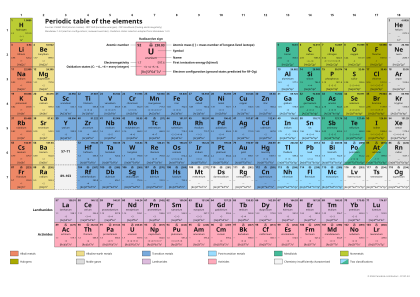
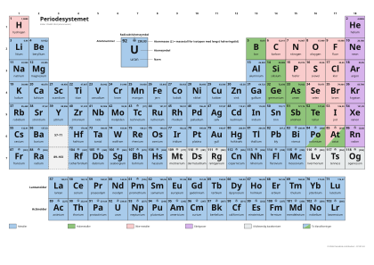

# Periodisk

An open-source Python package for generating accessible, source-traceable
periodic tables for chemistry teaching in SVG and PDF formats.
Version **2026.2** includes an offline, 118-element dataset, with British
English and Norwegian Bokmål localisation.

See [DATA_SOURCES.md](docs/DATA_SOURCES.md) for data sources, scientific
citations, and known limitations.

## Examples

| Detailed English table | Simplified Norwegian table |
| --- | --- |
| [](examples/en_GB/pdf/periodic-table-en-a3.pdf) | [](examples/nb_NO/pdf/periodic-table-nb-a3-broad-light-simplified-broad.pdf) |

Select a preview to open its print-ready PDF. These tables correspond to the
two command-line examples in the [Usage](#usage) section.

Print-ready PDFs and editable SVGs are available in [`examples/`](examples/).
They are grouped by locale and file format:

```text
examples/
├── en_GB/
│   ├── pdf/
│   └── svg/
└── nb_NO/
    ├── pdf/
    └── svg/
```

The examples include selected colour schemes and cell styles, plus simplified
tables (using the broad classes metals, metalloids, nonmetals, and noble gases).
See [`examples/README.md`](examples/README.md) for the inventory and filename
conventions, or [compare all selectable colour schemes](docs/colour-schemes.svg).

## Installing

Periodisk requires Python 3.13 or newer. Install the latest release from PyPI:

```console
python -m pip install periodisk
```

Instructions for installing a development checkout are given in
[Development](#development).

## Usage

### Command line

The `periodisk render` command writes a periodic table to an SVG or PDF file.
The output format is inferred from the filename extension.

Render the default English table on an A3 page:

```console
periodisk render periodic-table.pdf --language en_GB --page-size A3
```

[View the resulting table](examples/en_GB/pdf/periodic-table-en-a3.pdf).

Render a simplified Norwegian table using broad element classes:

```console
periodisk render periodesystemet.pdf --language nb_NO --content simplified --classification broad --colour-scheme broad-light
```

[View the resulting table](examples/nb_NO/pdf/periodic-table-nb-a3-broad-light-simplified-broad.pdf).

The default uses the Tol Light-inspired colour scheme and the full scientific
content. Common options include:

- `--language en_GB|nb_NO`
- `--page-size A3|A4`
- `--format svg|pdf` to override format inference from the filename
- `--content full|simplified`
- `--classification detailed|broad`
- `--colour-scheme SCHEME`
- `--cell-style full|gutters|soft-rules`
- `--rounded-corners`
- `--electronegativity-scale pauling|allred-rochow|allen`

Run `periodisk render --help` for every option and its description. See
[DESIGN.md](docs/DESIGN.md) for palette and layout details and
[LOCALISATION.md](docs/LOCALISATION.md) for language support.

### Python API

The first command-line example can also be written as:

```python
from periodisk import render_table

render_table(
    "periodic-table.pdf",
    language="en_GB",
    page_size="A3",
)
```

## Development

The project supports Python 3.13 and 3.14. Its release policy is to support the
two most recent stable CPython versions that are still receiving regular bug
fixes.

Install the development dependencies and run the checks from the repository
root:

```console
python -m pip install -e '.[dev]'
python -m periodisk validate --release
python -m pytest
ruff check .
ruff format --check .
```

Ruff checks the Python code for common errors and style problems and enforces
consistent formatting. Run `ruff check --fix .` followed by `ruff format .`
before submitting changes.

The radioactive sign is native vector geometry and requires no separately
installed symbol font. Regenerate the web palette preview after changing
palette definitions with:

```console
PYTHONPATH=src python scripts/render_palette_preview.py
```

## Scientific data

Scientific data are stored locally as JSON. Runtime generation will therefore
never need to query Mendeleev or another online service. Sourced scientific
values carry identifiers from `sources.json`; editorial classifications and
translations are documented separately. First ionisation energies use
**kJ/mol**. See [DATA_SOURCES.md](docs/DATA_SOURCES.md) for sources, curation
methods, and known limitations.

## Versioning

Releases use a calendar-based `YYYY.N` scheme. `YYYY` is the release year and
`N` counts releases within that year; for example, `2026.1` is the first 2026
release.

## Licence

The project uses a simple dual-licence arrangement:

- Python source code is licensed under the [MIT License](LICENSE).
- Original documentation and rendered periodic tables are licensed under
  [CC BY 4.0](LICENSE-CONTENT.md).

The CC BY licence covers the project's original presentation and explanatory
material, including the editorial arrangement of the rendered tables. It does
not claim ownership of scientific facts or relicense third-party source
material. Rendered tables include a short CC BY notice, while their source
footer identifies the scientific provenance. Source-specific attribution and
licensing information is recorded in
[THIRD_PARTY_NOTICES.md](THIRD_PARTY_NOTICES.md).
