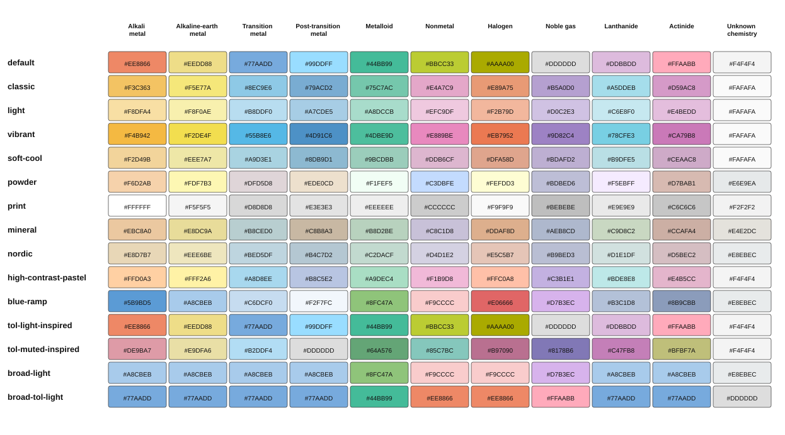

# Visual design

The table prioritises readable scientific content and print suitability.
Chemical classification is encoded primarily by cell colour and identified by
the legend. The scientific values remain readable independently of that
classification cue. All palettes use near-black text. An
[automated test](../tests/test_render_svg.py) checks every
palette background against its text colour using the sRGB relative-luminance
and contrast-ratio formulas from WCAG 2.2.[^wcag] Each pair must meet the 4.5:1
Level AA minimum for normal text.

The test decodes each hexadecimal sRGB colour, linearises its three channels,
calculates relative luminance as `0.2126 R + 0.7152 G + 0.0722 B`, and compares
the lighter and darker luminances as `(L1 + 0.05) / (L2 + 0.05)`. It applies
this calculation to every entry in `PALETTES` against that scheme's text
colour, currently `#111111`.

This is a conservative numerical design check, including for text large enough
to qualify for WCAG's lower 3:1 threshold. It is not a claim of complete WCAG
conformance. It tests text–background contrast, not whether category colours
are distinguishable from one another, and does not model colour-vision
deficiencies, paper, ink, printer profiles, or viewing conditions.

## Colour and classification

The default is a ten-family adaptation of Paul Tol's Light qualitative
palette,[^tol] which was designed for labelled cells. `tol-light-inspired`
selects the same treatment explicitly. `classic` is derived from the
colour-universal palette developed by Masataka Okabe and Kei Ito[^okabe-ito]
and described by Bang Wong.[^wong] Other schemes provide lighter, muted,
vivid, grayscale, and print-oriented alternatives.

. The chart is
generated from the renderer's palette definitions with:

```console
PYTHONPATH=src python scripts/render_palette_preview.py
```

The detailed classification has ten families. Po and At use diagonal split
fills, and elements whose chemistry is insufficiently characterised use a
neutral fill. The SVG retains conventional family information in
`data-classifications` even when the visible treatment is neutral.

The optional `broad` mode merges the families into metals, metalloids,
nonmetals, and noble gases. It preserves the neutral chemistry status and the
split treatment of Po and At. `broad-light` and `broad-tol-light` are designed
specifically for this four-colour classification.

Every rendered table includes a legend that names the colour categories, but
the legend is not a redundant visual encoding. Readers who cannot distinguish
two fills may also be unable to assign the corresponding elements to their
classes. The SVG retains classification names as metadata; printed tables do
not currently provide a non-colour classification encoding.

## Cell content

The full layout contains atomic number, atomic mass, symbol, name,
electronegativity, first ionisation energy, oxidation states, and ground-state
electron configuration. Labels for the compact scientific fields are omitted
from individual cells. An enlarged uranium example explains their positions.
Its callouts also explain bracketed isotope mass numbers.

The simplified layout retains atomic number, atomic mass, symbol, name, and
the radioactivity marker, using larger type to make better use of each cell.

The radioactivity symbol means that an element has no stable isotopes. It is
drawn as native SVG geometry for consistent SVG and PDF output without a
platform-specific symbol font.

## Layout options

Cells are square with full fills by default. The independent visual options
are:

- `--rounded-corners` for a subtle 0.8 mm radius in the canonical A3 output;
- `--cell-style gutters` for narrow white separation between cells; and
- `--cell-style soft-rules` for thinner grey grid lines.

Colour scheme, classification mode, content density, cell style, and rounded
corners can be combined independently.

## References

[^wcag]: W3C, [*Web Content Accessibility Guidelines (WCAG) 2.2*, Success
    Criterion 1.4.3](https://www.w3.org/TR/WCAG22/#contrast-minimum) and
    [relative-luminance
    definition](https://www.w3.org/TR/WCAG22/#dfn-relative-luminance).

[^tol]: Paul Tol, [*Colour Schemes*, technical note SRON/EPS/TN/09-002, issue
    3.2](https://sronpersonalpages.nl/~pault/data/colourschemes.pdf) (2021).

[^okabe-ito]: Masataka Okabe and Kei Ito,
    [*Color Universal Design*](https://jfly.uni-koeln.de/color/) (2002–2008).

[^wong]: Bang Wong, “Color blindness,” *Nature Methods* **8**, 441 (2011),
    [doi:10.1038/nmeth.1618](https://doi.org/10.1038/nmeth.1618).
